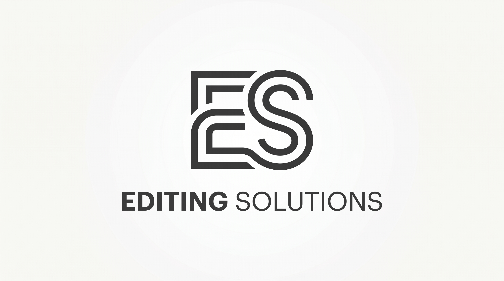

# Editing Solutions



A responsive web application designed to be a comprehensive source for your video and audio editing needs. This project serves as a frontend or landing page, offering information and potentially access to various editing solutions.

## 🌟 Key Features & Benefits

*   **Modern & Responsive Design**: Built with Tailwind CSS for a sleek, mobile-first user experience that adapts across devices.
*   **Intuitive User Interface**: Features a clean and well-structured layout designed for easy navigation and an engaging user journey.
*   **Rich Iconography**: Leverages Font Awesome to integrate expressive and easily recognizable icons, enhancing visual communication.
*   **Custom Typography**: Utilizes the Raleway font from Google Fonts to ensure enhanced readability and a consistent brand aesthetic.
*   **Dedicated to Editing Needs**: Positions itself as a central hub or portal for video and audio editing services, resources, or tools.

## 🚀 Getting Started

Follow these simple instructions to get a copy of the project up and running on your local machine for development and testing purposes.

### Prerequisites

You only need a modern web browser to view this project, as it is a static website.

*   **Web Browser**: Google Chrome, Mozilla Firefox, Apple Safari, Microsoft Edge, or any other modern web browser.

### Installation & Setup

This project is a static website and does not require any complex installation or backend setup.

1.  **Clone the Repository**:
    Open your terminal or command prompt and execute the following command to clone the project repository:
    ```bash
    git clone https://github.com/John-Nyabwari/Editor.git
    ```
2.  **Navigate to Project Directory**:
    Change into the newly cloned project directory:
    ```bash
    cd Editor
    ```
3.  **Open in Browser**:
    Simply open the `index.html` file in your preferred web browser. You can typically do this by double-clicking the file in your file explorer, or by using a command:
    ```bash
    # On macOS
    open index.html

    # On Windows
    start index.html

    # On Linux (using xdg-open, may vary)
    xdg-open index.html
    ```
    For a more convenient development experience, you might consider using a local web server (e.g., the Live Server extension for VS Code) to serve the files, which often provides live reloading.

## 💡 Usage

Once the `index.html` file is open in your browser, you can navigate through the different sections of the website. Explore the content to learn about the various video and audio editing solutions, services, or information provided.

The project is designed to be self-explanatory for end-users, with all interactions happening directly within the browser.

## ⚙️ Configuration

This project is primarily a static frontend and does not currently offer configurable settings or environment variables for end-users. All customization would involve directly editing the project's source files:

*   **HTML Structure**: Modify `index.html` to change content and layout.
*   **CSS Styling**: Adjust Tailwind CSS classes within the HTML or extend Tailwind in a custom stylesheet (if implemented) to modify visual styles.
*   **Assets**: Replace `bg.jpg`, `es-logo.jpeg`, `es-logo.svg` to update imagery.

## 🤝 Contributing

We welcome contributions to the Editor project! If you'd like to contribute, please follow these steps:

1.  **Fork the repository**: Click the "Fork" button at the top right of this page on GitHub.
2.  **Clone your forked repository**:
    ```bash
    git clone https://github.com/YOUR_USERNAME/Editor.git
    cd Editor
    ```
3.  **Create a new branch**: Choose a descriptive name for your branch.
    ```bash
    git checkout -b feature/your-feature-name
    ```
4.  **Make your changes**: Implement your features or bug fixes.
5.  **Commit your changes**: Write clear and concise commit messages.
    ```bash
    git commit -am 'feat: add a new section for audio services'
    ```
6.  **Push to the branch**:
    ```bash
    git push origin feature/your-feature-name
    ```
7.  **Open a Pull Request**: Go to the original repository on GitHub and open a pull request from your forked repository. Provide a detailed description of your changes.

Please ensure your code adheres to good coding practices and includes relevant comments where necessary.

## 📝 License

This project is currently **unlicensed**.

It is highly recommended to add a license to your repository to define the terms under which others can use, modify, and distribute your project. Popular choices include MIT (permissive), Apache 2.0 (permissive with patent grants), or GPLv3 (copyleft).

## 🙏 Acknowledgments

*   **John-Nyabwari**: The owner and initial developer of this project.
*   **Tailwind CSS**: For providing an excellent utility-first CSS framework that streamlines UI development.
*   **Font Awesome**: For the iconic font and SVG toolkit, enriching the visual design.
*   **Google Fonts (Raleway)**: For the beautiful and accessible Raleway typeface used throughout the project.
*   **All Future Contributors**: To anyone who contributes to making this project better.
